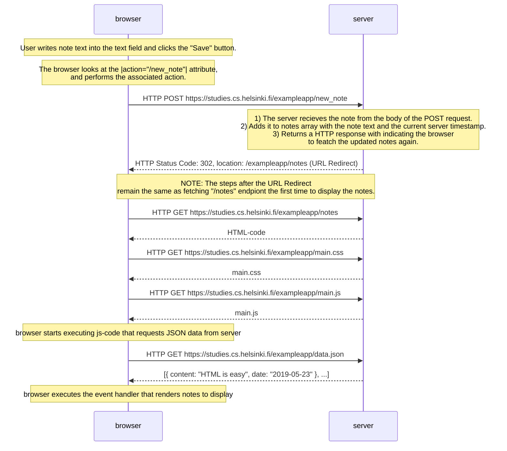
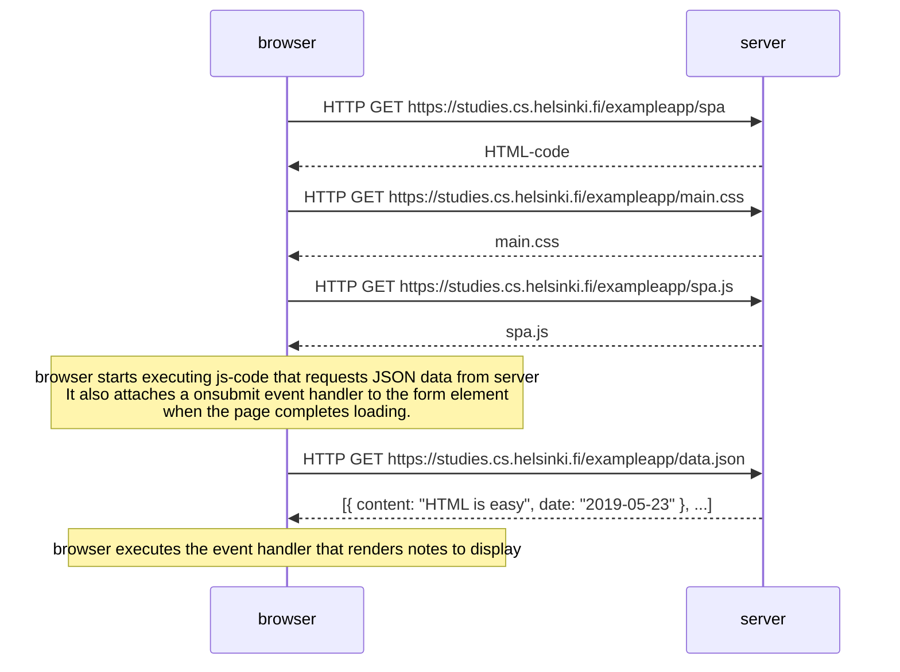
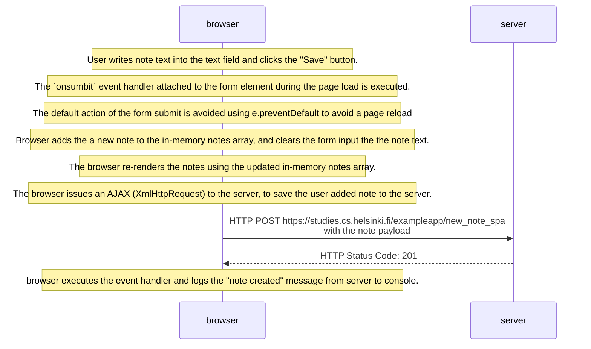

# Assignment

## 0.4: new note

Create a similar diagram depicting the situation where the user creates a new note on page https://studies.cs.helsinki.fi/exampleapp/notes by writing something into the text field and clicking the submit button.

## 0.5: Single page app

Create a diagram depicting the situation where the user goes to the single page app version of the notes app at https://studies.cs.helsinki.fi/exampleapp/spa.

## 0.6: New note

Create a diagram depicting the situation where the user creates a new note using the single page version of the app.

NOTE: In this case, if due to some networking issue, after the user submits the note but did not have a live internet connection. The web page will display that the note is added to the notes, even though it would not actually have been added to the server. Ie. the user will not see the note after a page referesh. Also, the console log message "note created" will not be printed since the response status is not 201.